# The Verdict — World Cup 2026 Odds Accuracy Study

## 1. Product Overview

**The Verdict** is an interactive web study that measures how accurately pre-match betting odds predicted the real outcomes of FIFA World Cup 2026 matches. Bookmaker odds are treated as probabilistic forecasts; actual match results are the ground truth. Across many matches the app aggregates standard forecasting-accuracy metrics — prediction accuracy, Brier score, log loss, ranked probability score (RPS), and calibration — and presents them as an editorial, scroll-driven report.

- **Problem solved**: Are betting odds actually good predictions? How do we measure that rigorously, across many matches?
- **Target users**: Sports analysts, data-curious football fans, students of probability/prediction markets.
- **Value**: A transparent, reproducible methodology and a visually compelling verdict on the predictive power of the WC2026 odds market.

> Data note: The tournament is ongoing (final 19 July 2026). The embedded dataset is a representative sample of completed matches (group stage + early knockouts), clearly labeled as illustrative and structured so real results can be dropped in without code changes.

## 2. Core Features

### 2.2 Feature Modules
1. **Overview** — hero title, executive summary, headline metric cards (accuracy, Brier, log loss, RPS, matches analyzed).
2. **Methodology** — how decimal odds become normalized implied probabilities; how each accuracy metric is defined; how "prediction" is derived from odds.
3. **Results Dashboard** — aggregated metrics with charts: accuracy by tournament stage, accuracy by odds-confidence bucket, cumulative accuracy over match order, Brier distribution.
4. **Calibration Lab** — reliability diagram (predicted vs observed frequency), favorite-bias analysis, bookmaker margin (overround) distribution.
5. **Match Ledger** — searchable, sortable, filterable table of every match: teams, stage, decimal odds, implied probs, predicted outcome, actual result, per-match contribution to Brier/log loss, correct/incorrect badge.

### 2.3 Page Details

| Section | Module | Feature description |
|---------|--------|---------------------|
| Overview | Hero | Full-bleed editorial title, tournament subtitle, scroll cue |
| Overview | Headline metrics | 5 large stat cards with computed values + one-line interpretation |
| Overview | Executive summary | 3–4 short paragraphs of plain-English findings |
| Methodology | Odds → probability | Visual walkthrough of implied prob + overround removal |
| Methodology | Metric definitions | Cards defining accuracy, Brier, log loss, RPS with formulas |
| Results Dashboard | Stage breakdown | Grouped bar chart: accuracy by stage (Group / R32 / R16 / QF…) |
| Results Dashboard | Confidence buckets | Bar chart: accuracy when favorite implied prob in [50–60%], [60–70%], etc. |
| Results Dashboard | Cumulative curve | Line chart: running accuracy as matches accumulate |
| Results Dashboard | Brier distribution | Histogram of per-match Brier scores |
| Calibration Lab | Reliability diagram | Predicted-prob bins vs observed win frequency, with diagonal reference |
| Calibration Lab | Favorite bias | Does the favorite win more or less often than predicted? |
| Calibration Lab | Margin analysis | Distribution of bookmaker overround across matches |
| Match Ledger | Filter controls | Search by team, filter by stage / correctness |
| Match Ledger | Match table | Sortable rows with odds, prediction, result, per-match scores |

## 3. Core Process

A reader lands on the Overview, absorbs the headline verdict, scrolls into Methodology to understand *how* the numbers are computed, then explores Results and Calibration to see the evidence, and finally drills into the Match Ledger to inspect individual matches. All metrics are computed client-side from a single embedded JSON dataset, so the reader can verify any aggregate against the raw rows.

```mermaid
flowchart LR
    A["Reader lands on Overview"] --> B["Reads headline metrics + verdict"]
    B --> C["Scrolls to Methodology"]
    C --> D["Learns how odds become probabilities and scores"]
    D --> E["Explores Results Dashboard charts"]
    E --> F["Inspects Calibration Lab"]
    F --> G["Opens Match Ledger"]
    G --> H["Filters / sorts to verify a specific claim"]
    H --> I["Returns to Overview with full context"]
```

## 4. User Interface Design

### 4.1 Design Style
- **Aesthetic**: Editorial scientific journal × sports almanac. Refined, intellectual, with quiet athletic energy in the data. Long-form, scroll-driven, generous whitespace, strong typographic hierarchy.
- **Palette**:
  - Background: warm parchment `#F4EFE3` (light editorial base)
  - Ink: `#161512` (near-black, warm)
  - Paper-alt panels: `#ECE5D4`
  - Trophy gold (primary accent): `#B8893A`
  - Pitch green (correct / positive): `#2F6B4B`
  - Verdict crimson (incorrect / negative): `#A23B2E`
  - Muted slate (secondary data): `#6B6357`
- **Buttons**: Minimal, ink-outlined with gold fill on primary; square-ish 2px radius; no 3D.
- **Typography**:
  - Display: `Fraunces` (soft optical serif, editorial) — hero + section titles
  - Body: `Hanken Grotesk` (clean humanist sans) — paragraphs, UI
  - Mono: `JetBrains Mono` — all numbers, odds, metrics, table data
- **Layout**: Single-page scroll, max-width reading column (~1100px) for prose, full-bleed for hero and charts. Sticky slim top nav with section anchors. Card-based metric panels with hairline borders, no heavy shadows.
- **Iconography**: Minimal geometric marks + typographic labels; no emoji.
- **Motion**: Staggered fade/raise on section enter (CSS + Framer Motion), animated number count-ups for headline metrics, chart draw-in on scroll into view. Subtle grain overlay on hero for paper texture.

### 4.2 Page Design Overview

| Section | Module | UI Elements |
|---------|--------|-------------|
| Overview | Hero | Parchment bg, grain overlay, oversized Fraunces title, gold hairline rule, scroll cue |
| Overview | Headline metrics | 5 cards in a row (responsive grid), mono numbers, gold label, micro-sparkline |
| Overview | Executive summary | Narrow reading column, drop-cap, justified prose |
| Methodology | Odds → probability | Step diagram with sample odds, computed implied probs, normalized probs |
| Methodology | Metric cards | 4 formula cards with LaTeX-style mono formulas + plain-English gloss |
| Results Dashboard | Charts | Recharts: grouped bar, bucketed bar, cumulative line, histogram — gold/green/crimson |
| Calibration Lab | Reliability diagram | Scatter + diagonal reference line, confidence bands |
| Match Ledger | Table | Dense mono table, sticky header, zebra rows, color-coded correctness pill |

### 4.3 Responsiveness
Desktop-first (≥1100px reading width). On <900px: headline metrics wrap to 2 columns then 1, charts stack, table becomes horizontally scrollable, nav collapses to a top dropdown. Touch targets ≥44px.

### 4.4 3D Scene Guidance
Not applicable — this is a 2D editorial data study.
