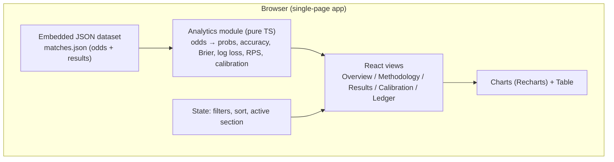
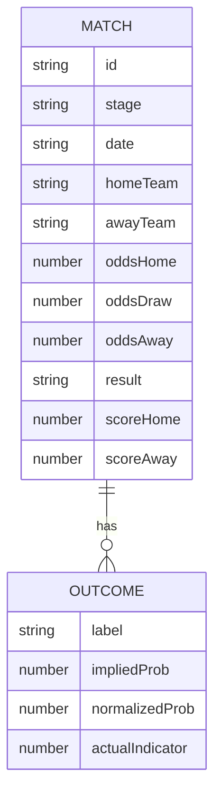

# Technical Architecture — The Verdict (WC2026 Odds Accuracy Study)

## 1. Architecture Design

A single-page React application. All data and computation live client-side — no backend, no external services. A single embedded JSON dataset of WC2026 matches feeds a pure-TS analytics module that computes every metric. Charts render with Recharts; prose and tables are static React components.



## 2. Technology Description
- **Frontend**: React 18 + TypeScript + Vite
- **Styling**: TailwindCSS 3 (custom theme tokens for parchment/ink/gold/green/crimson) + a small CSS layer for fonts and grain
- **Charts**: Recharts (responsive, React-native, clean defaults)
- **Animation**: Framer Motion (section reveals, number count-ups, chart draw-ins)
- **Fonts**: Fraunces (display), Hanken Grotesk (body), JetBrains Mono (data) — via Google Fonts `<link>`
- **Initialization Tool**: `npm create vite@latest` (react-ts template)
- **Backend**: None
- **Database**: None — single embedded `matches.json` dataset; structured so it can be swapped for real results without touching code

## 3. Route Definitions
Single-page scroll experience with anchor sections (no router needed). A sticky top nav scrolls to / highlights the active section.

| Anchor | Section | Purpose |
|--------|---------|---------|
| `#overview` | Overview | Hero, headline metrics, executive summary |
| `#methodology` | Methodology | Odds→probability walkthrough, metric definitions |
| `#results` | Results Dashboard | Aggregated charts (stage, buckets, cumulative, Brier) |
| `#calibration` | Calibration Lab | Reliability diagram, favorite bias, margin analysis |
| `#ledger` | Match Ledger | Filterable/sortable match table |

## 4. API Definitions
Not applicable — no backend. All data is local.

## 5. Server Architecture Diagram
Not applicable — static client-only build.

## 6. Data Model

### 6.1 Data Model Definition

A single `Match` entity. All metrics are derived from it.



### 6.2 Data Definition Language

TypeScript types (the app's contract):

```ts
type Stage = "Group" | "R32" | "R16" | "QF" | "SF" | "3rd" | "Final";
type Result = "H" | "D" | "A"; // Home win / Draw / Away win

interface Match {
  id: string;            // e.g. "G1"
  stage: Stage;
  date: string;          // ISO
  homeTeam: string;
  awayTeam: string;
  oddsHome: number;      // decimal odds
  oddsDraw: number;
  oddsAway: number;
  result: Result;        // ground truth
  scoreHome: number;
  scoreAway: number;
}
```

### 6.3 Derived Analytics (computed at runtime)

For each match:
- `impliedHome = 1/oddsHome`, `impliedDraw = 1/oddsDraw`, `impliedAway = 1/oddsAway`
- `overround = impliedHome + impliedDraw + impliedAway` (bookmaker margin; >1)
- `pHome = impliedHome/overround`, `pDraw = impliedDraw/overround`, `pAway = impliedAway/overround` (normalized, margin-free)
- `predicted = argmax(pHome, pDraw, pAway)` → predicted outcome label
- `correct = (predicted === result)`
- `brier = (pHome - I_H)^2 + (pDraw - I_D)^2 + (pAway - I_A)^2` where `I_x` is 1 if `result===x` else 0
- `logLoss = -ln(pActual)` where `pActual` is the normalized prob assigned to the actual result
- `rps = Ranked Probability Score` over the ordered outcomes (H/D/A)

Aggregates across N matches:
- `accuracy = mean(correct)`
- `brierScore = mean(brier)`
- `logLossScore = mean(logLoss)`
- `rpsScore = mean(rps)`
- Calibration: bin matches by predicted favorite prob, compare mean predicted vs observed frequency.
